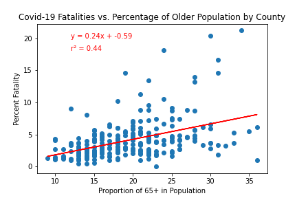

# Project1-covid-analysis

# Summary

This script looks at Texas demographic data broken down by county compared to the county's rate of COVID-19 infections and fatalities. The goal of this project was to determine the types of communities that may have higher risk factors in order to determine how treatment and prevention should be distributed to ensure equitable outcomes. 

To factor out the wide distribution of county populations, most calculations were made compared to each county's total population (ie. number of infections per 100 people). 

# County Fatality Rate Compared to Proportion of Older (65+) Population

The proportion of 65+ population was obtained by calculating the total number of individuals aged 65+ and dividing by the county's total population. The proportion of 65+ was plotted compared to the county's fatality rate, defined by the number of COVID-19 infected individuals who died due to the disease. 

The scatterplot shows a moderately positive correlation coefficient of 0.44, indicating that there is some relationship between the proportion of older individuals in a community and the COVID-19 death rate. 

# Fatality Broken Down by Race

This barchart compares the percentage of total COVID-19 deaths broken down by race/ethnicity. Note there was incomplete data for some races/ethnicities which were not included. The yellow bars represent the expected population distribution of races/ethnicites used to run a chi-squared test. 

The chi-squared value for 4 degrees of freedom when the probability value is set to < 0.05 is 9.48. The value of the test statistic was calculated to be 1578.9, which is greater than the critical value, so we reject the null hypothesis that the distribution of COVID-19 deaths by race/ethnicity is the same as the distribution of race/ethnicity in the general population. From the chart, we see that the number of deaths in hispanic communities is much larger than the distribution of the hispanic population. 

# Infections and Population Density

This scatterplot compares the population density of each county to the number of COVID-19 infections. With a strong correlation coefficient of 0.96, we can conclude that there is a positive relationship between population density and the total number of infected individuals. 

# Health Insurance Coverage

The final barchart compares the proportion of uninsured individuals and the percentage of COVID-19 fatalities. The chart shows no relationship between communities with higher uninsurance rates and COVID-19 fatalities. 